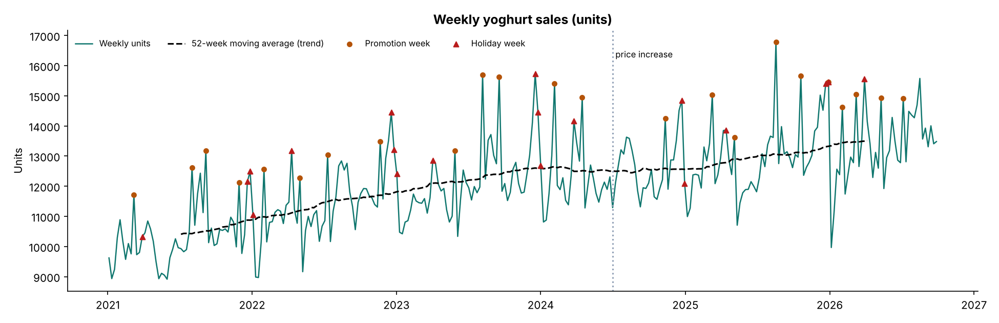
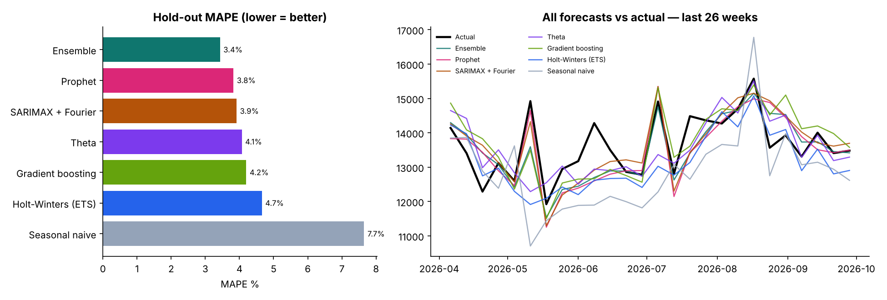
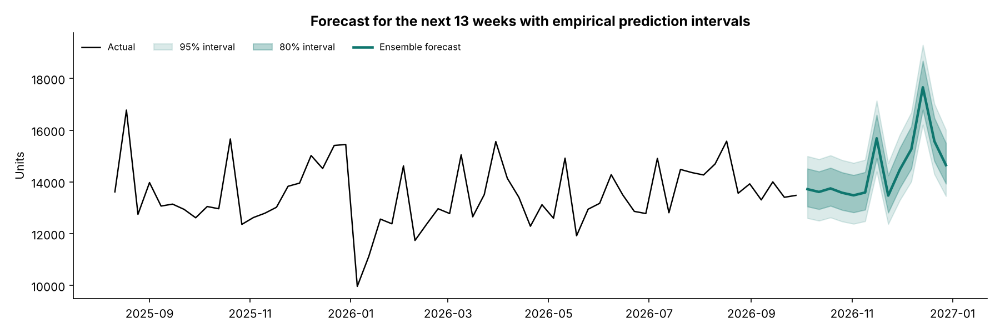

# Weekly Sales Forecasting — six time-series models compared (Python & R)

Forecasting weekly yoghurt sales for a Kenyan dairy business with **six models**, from a seasonal-naive benchmark to machine learning, plus an **ensemble**. The models are evaluated on a 26-week hold-out *and* a rolling-origin backtest, and the final forecast for Q4 2026 comes with empirical prediction intervals. The classical models are rebuilt in **base R** for an independent check.

> **Data note:** the weekly series (Jan 2021 – Sep 2026, 300 weeks) is **synthetic**, generated by [`data/generate_sales.py`](data/generate_sales.py) with realistic trend, a price-increase structural break, yearly seasonality, holidays, promotions with post-promo dips, and autocorrelated noise. No real company data is used.

| | |
|---|---|
| 📓 **Full walkthrough, every step explained** | [`python/sales_forecasting.ipynb`](python/sales_forecasting.ipynb) |
| 🧩 **The six models (one file, same interface)** | [`python/models.py`](python/models.py) |
| 📊 **R rebuild + results** | [`R/sales_forecasting.R`](R/sales_forecasting.R) → [`outputs/r/R_results.md`](outputs/r/R_results.md) |
| 📅 **Next-quarter forecast with intervals** | [`outputs/python/forecast_next_13_weeks.csv`](outputs/python/forecast_next_13_weeks.csv) |

---

## 1. Why forecast?

Yoghurt has a short shelf life, so a forecast error costs money in **both directions**: over-forecasting means expiry and write-offs, and under-forecasting means stock-outs and lost shelf space. Weekly forecasts drive **production planning, milk procurement, distribution and S&OP**. Better accuracy means less safety stock, less waste and fewer lost sales.

---

## 2. Understanding the series first



| Diagnostic | Result | Implication |
|---|---|---|
| STL decomposition | Trend strength 0.69, seasonal strength 0.52 | Models must capture both |
| ADF / KPSS on log(units) | Non-stationary → stationary after 1st difference | ARIMA needs d = 1 |
| ACF / PACF | Short-lag autocorrelation + lag-52 seasonality | ARIMA errors + Fourier seasonality |
| Seasonal swings grow with level | Multiplicative seasonality | Model log(units) |
| Promo / holiday weeks | Clear spikes + post-promo dips | Use the promo calendar as regressors |

---

## 3. The six models

| # | Model | How it works | Uses promo calendar? |
|---|---|---|:---:|
| 1 | **Seasonal naive** | Same week last year (the benchmark) | ✗ |
| 2 | **Holt-Winters (ETS)** | Exponentially smoothed level, damped trend and 52-week seasonality | ✗ |
| 3 | **Theta** | Deseasonalise → long-run trend line + exponential smoothing (M3 winner) | ✗ |
| 4 | **SARIMAX + Fourier** | log(units) regression on 6 Fourier pairs + promo / post-promo / holiday / price, with ARIMA(0,1,2) errors chosen by AIC | ✓ |
| 5 | **Prophet** | Piecewise trend with automatic changepoints × yearly seasonality × regressors | ✓ |
| 6 | **Gradient boosting** | ML model predicting year-on-year growth vs the same week last year from calendar, promo and holiday features (this year and last) | ✓ |
| + | **Ensemble** | Average of ETS, SARIMAX, Prophet and gradient boosting | ✓ |

---

## 4. Results

### 26-week hold-out (Apr – Sep 2026)

| Model | MAPE | MASE | Bias |
|---|---:|---:|---:|
| **Ensemble** | **3.4%** | **0.45** | −1.1% |
| Prophet | 3.8% | 0.50 | −1.2% |
| SARIMAX + Fourier | 3.9% | 0.51 | −0.1% |
| Theta | 4.1% | 0.55 | −0.7% |
| Gradient boosting | 4.2% | 0.55 | +0.5% |
| Holt-Winters (ETS) | 4.7% | 0.63 | −3.6% |
| Seasonal naive | 7.7% | 1.03 | −5.8% |



### Rolling-origin backtest (4 origins × 13 weeks)

| Model | Avg MAPE | Avg MASE | Folds won |
|---|---:|---:|---:|
| **Ensemble** | **3.4%** | **0.44** | 2 |
| SARIMAX + Fourier | 3.8% | 0.48 | 1 |
| Prophet | 3.9% | 0.50 | 1 |
| Gradient boosting | 4.8% | 0.63 | 0 |
| Holt-Winters (ETS) | 5.2% | 0.69 | 0 |
| Theta | 5.3% | 0.69 | 0 |
| Seasonal naive | 7.5% | 1.01 | 0 |

**Takeaways:**

- The **ensemble** is the most accurate and the most stable.
- The models that know the **promo / holiday calendar** (SARIMAX, Prophet) come next.
- Gradient boosting looked good on one hold-out but was **less stable** across the backtest, which only a backtest reveals.
- Every model beats the seasonal-naive benchmark (MASE < 1).

### Promotion and price effects (SARIMAX)

| Regressor | Estimated effect | True effect in the data |
|---|---:|---:|
| Promotion week | **+17.7%** | +18% |
| Week after promotion | **−6.2%** | −6% |
| Holiday week | **+8.6%** | +8% |
| July 2024 price increase | **−5.8%** | −6% |

Estimating the effects jointly with trend and seasonality recovers them almost exactly. Simple before/after averages understated them by about half.

### Diagnostics

The SARIMAX residuals are centred and symmetric, but **Ljung-Box flags remaining short-lag autocorrelation** (p < 0.05). The final forecast therefore uses **empirical prediction intervals** built from real backtest errors rather than the model's theoretical intervals.

### Q4 2026 forecast



The next 13 weeks total **≈188,500 units** (80% interval about 179,000 – 199,000), with the mid-December promotion week peaking at about **17,700 units**.

### Business value

At a 95% service level (safety stock ≈ 1.65 × RMSE), the ensemble needs about **970 units** of weekly safety stock against **2,290** for the seasonal-naive approach. That's **~57% less buffer stock** that could expire.

---

## 5. R rebuild

Six models in base R (`stats` only): seasonal naive, Holt-Winters, ARIMA(0,1,2) + Fourier + regressors, STL + exponential smoothing, harmonic regression, and an ensemble.

| R model | Hold-out MAPE |
|---|---:|
| **Ensemble** | **3.7%** |
| ARIMA + Fourier | 4.2% |
| Harmonic regression | 4.2% |
| Holt-Winters | 4.4% |
| STL + ETS | 4.6% |
| Seasonal naive | 7.7% (identical to Python) |

The R run reaches the same conclusion: an ensemble of calendar-aware models wins. The ARIMA promo effect comes out at **+17.7%**, the same as in Python.

---

## 6. Which model when?

| Model | Use when |
|---|---|
| Seasonal naive | Always, as the benchmark |
| ETS / Theta | Many SKUs, few known drivers, need speed and robustness |
| SARIMAX | Promo and price effects must be **quantified** and explained |
| Prophet | Business series with trend breaks and holidays; non-technical audiences |
| Gradient boosting | Many series and many drivers (weather, prices, competitors) |
| Ensemble | Production forecasts: usually the most accurate and stable |

## 7. Where time-series forecasting is used

FMCG demand and production planning · milk-collection volume planning · retail replenishment · revenue and cash-flow forecasting · electricity load and solar output · hospital admissions and drug stock · disease surveillance (e.g. malaria seasonality) · mobile-money transaction volumes · logistics capacity planning.

## 8. Limitations and next steps

- Real sales are **censored by stock-outs** (sales ≠ demand). Correct for them before modelling.
- **Hierarchical forecasting** across SKU × region × channel, with reconciliation.
- More drivers: **price elasticity, rainfall**, competitor promotions.
- **Probabilistic optimisation:** choose production against the full forecast distribution and the asymmetric cost of waste vs stock-outs (newsvendor).
- Weekly **monitoring** of MAPE and bias, with retraining triggers.

---

## 9. Run it

```bash
pip install -r requirements.txt
python data/generate_sales.py                                   # optional: regenerate data
python python/build_notebook.py
jupyter nbconvert --to notebook --execute --inplace python/sales_forecasting.ipynb
Rscript R/sales_forecasting.R                                   # base R only; run after the notebook for the cross-check
```

```
sales-forecasting-time-series/
├── data/      generate_sales.py · weekly_sales.csv
├── python/    models.py (six models + ensemble + metrics) · build_notebook.py · sales_forecasting.ipynb
├── R/         sales_forecasting.R
└── outputs/   python/ (charts, hold-out & backtest metrics, Q4 forecast) · r/ (charts, R_results.md)
```

**Stack:** Python · pandas · statsmodels (ETS, Theta, SARIMAX, STL) · Prophet · scikit-learn · matplotlib · R (stats: HoltWinters, arima, stl, lm)
