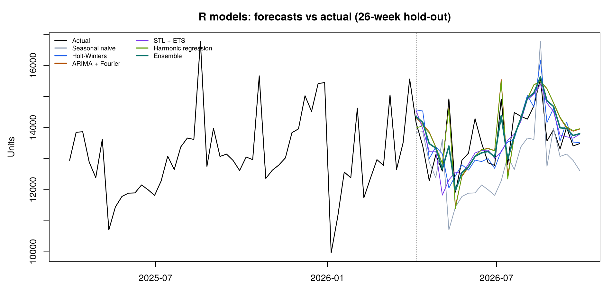
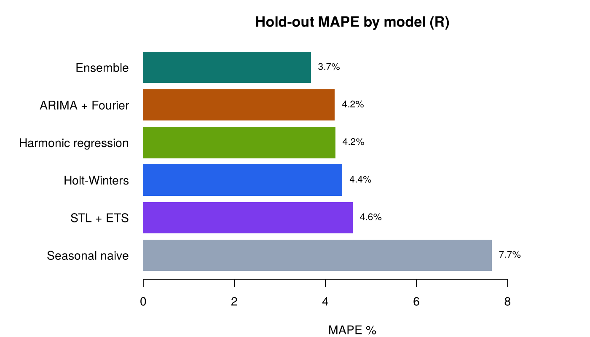

# Sales Forecasting — R results (auto-generated by `R/sales_forecasting.R`)

*300 weeks · hold-out = last 26 weeks (2026-04-06 to 2026-09-28) · base R only*

## Hold-out accuracy

| model | MAE | RMSE | MAPE % | MASE | Bias % |
| --- | --- | --- | --- | --- | --- |
| Ensemble | 504.95 | 650.23 | 3.68 | 0.49 | 0.72 |
| ARIMA + Fourier | 567.34 | 702.71 | 4.21 | 0.55 | 1.65 |
| Harmonic regression | 568.20 | 702.35 | 4.22 | 0.55 | 1.54 |
| Holt-Winters | 607.92 | 858.36 | 4.37 | 0.59 | -0.14 |
| STL + ETS | 632.97 | 828.92 | 4.60 | 0.61 | -0.18 |
| Seasonal naive | 1066.50 | 1375.66 | 7.65 | 1.03 | -5.79 |

## ARIMA(0,1,2) regressor effects

- promo: **+17.7%**
- post_promo: **-6.7%**
- holiday: **+9.6%**
- price_step: **-7.8%**

Ljung-Box p-values on ARIMA residuals: lag 4 = 0.003, lag 13 = 0.008, lag 26 = 0.062

## Cross-check with Python

- Seasonal naive metrics identical to Python: max difference 1.78e-15
- ARIMA(0,1,2) + Fourier MAPE: R 4.21% vs Python SARIMAX 3.91% (same specification, different optimisers)
- Holt-Winters MAPE: R 4.37% vs Python 4.66% (R's HoltWinters has no damping; parameters differ)

**Reading the results:** the models that use the promo/holiday calendar (ARIMA + Fourier, harmonic regression) beat the pure smoothing methods, and every model beats the seasonal-naive benchmark. That's the same conclusion as the Python notebook, reached with a different language and different estimation code.
